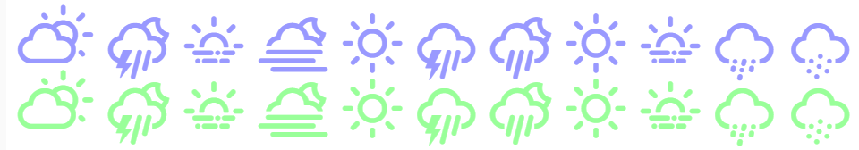

# Weather Icons Light

## Weather Themed Icons and CSS

Weather Icons Lite is a collection of weather themed icons, **which are already integrated within node-RED**, or can be used in any project that needs high quality weather & moon phase icons!



## Basic Usage

The icons are displayed by using an `<i...>` element, adding the base class wi and then the icon class you want.  
If you used Wunderground's 'wu' prefix and their 'partlycloudy' icon key, it would look like `<i class="wi wi-wu-partlycloudy"></i>`.  
The same format applies to Darksky & Openweathermap icon feeds; `<i class="wi wi-darksky-clear-day"></i>` and `<i class="wi wi-owm-01d"></i>` respectively.  
A full list of the Wunderground, Openweathermap, Darksky & Moon api mappings, which map the api output to a particular weather icon can be found on the [CSS Mapping](css_mappings.md) reference.

## Styling

To add a modifier, include the class you want after the icon name;

#### Size

Icons inherit the font-size from their parent container, and can be increased or decreased relatively using any of the following switches; `wi-1x`, `wi-2x`, `wi-3x`, up to `wi-10x` and also `wi-xs`, `wi-sm`, `wi-lg`.  
Example of a relative change; `<i class="wi wi-wu-partlycloudy wi-5x"></i>`

Icon size can also be changed by varying the `style` attribute of the containing HTML element;

```
<div style="font-size: 48px;">
<i class="wi wi-darksky-clear-day"></i>
</div>
```

#### Icon colour

Icons can be given a specific colour by adding a style attribute to the `<i class>`  
Example of changing icon colour; `<i class="wi wi-darksky-clear-day" style="color:red;"></i>`

#### Rotating icons

Icons can also be flipped or rotated, using any of the modifiers; `wi-flip-vertical`, `wi-flip-horizontal`, and `wi-rotate-23`, `wi-rotate-90`, `wi-rotate-180`, `wi-rotate-270`  
Example of icon rotation; `<i class="wi wi-wu-partlycloudy wi-rotate-270"></i>`

#### Positioning icons

To position the icon centrally in a node-RED dashboard element, it is necessary to add a `style` attribute around the `<i class>`;

```
<div style="flex; height:100%; justify-content:center; align-items:center;">
<i class="wi wi-darksky-clear-day">
</div>
```

## Example Flow

An example node-RED flow demonstrating a combination of the styling elements above;

```
[{"id":"67f03385.7ae68c","type":"ui_template","z":"a444a9ff.e7a408","group":"ddd690d2.0351d","name":"ui_template","order":2,"width":"5","height":"5","format":"<div style=\"display: flex;height: 100%;justify-content: center;align-items: center;\">\n<i class=\"wi wi-darksky-thunderstorm wi-4x wi-rotate-270\" style=\"color:red;\"></i>\n</div>","storeOutMessages":false,"fwdInMessages":true,"templateScope":"local","x":600,"y":1980,"wires":[[]]},{"id":"f0ce6f0.a8e049","type":"inject","z":"a444a9ff.e7a408","name":"","topic":"","payload":"","payloadType":"str","repeat":"5","crontab":"","once":true,"onceDelay":0.1,"x":440,"y":1980,"wires":[["67f03385.7ae68c"]]},{"id":"ddd690d2.0351d","type":"ui_group","z":"","name":"weather-icons-lite","tab":"117b6717.6166b9","disp":true,"width":"27","collapse":false},{"id":"117b6717.6166b9","type":"ui_tab","z":"","name":"Example","icon":"dashboard","order":7,"disabled":false,"hidden":false}]
```

## Credits

The icon designs are originally by [Lukas Bischoff](http://www.twitter.com/artill). Additional Icon art & CSS by [Erik Flowers](http://www.helloerik.com).  
Weather-icons-lite, CSS update & Node-red compatibility changes by me - Paul Reed.

## Licensing

* Weather Icons licensed under [SIL OFL 1.1](http://scripts.sil.org/OFL)
* Code licensed under [MIT License](http://opensource.org/licenses/mit-license.html)
* Documentation licensed under [CC BY 3.0](http://creativecommons.org/licenses/by/3.0)
