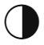
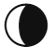
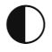

# Moon CSS Mapping
| Generic                                                 | Icon Name |           icon           |
| :-------------------------- | :-------- | :----------------------: |
| wi-moon-new                    | f0dd      |      |
| wi-moon-wax-cres               | f0de      |      |
| wi-moon-first-quart            | f0df      |      |
| wi-moon-wax-gibb               | f0e0      |      |
| wi-moon-full                   | f0e1      |      |
| wi-moon-wan-gibb               | f0da      |      |
| wi-moon-third-quart            | f0db      |      |
| wi-moon-wan-cres               | f0dc      |      |
