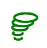
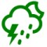
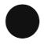
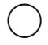
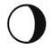
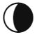

# Weather CSS Mapping
| Wunderground                                                 | Darksky                        | Openweathermap | Icon Name |           icon           |
| :-------------------------- | :----------------- | :------------- | :-------- | :----------------------: |
| wi-wu-clear wi-wu-sunny | wi-darksky-clear-day           | wi-owm-01d     | f00d      |      |
| wi-wu-nt_clear wi-wu-nt_mostlysunny wi-wu-nt_sunny | wi-darksky-clear-night         | wi-owm-01n     | f02e      |      |
| wi-wu-chancerain                                             | wi-darksky-rain                | wi-owm-10d     | f019      |    |
| wi-wu-chancesnow wi-wu-snow                             | wi-darksky-snow                | wi-owm-13d     | f01b      |      |
| wi-wu-chancesleet wi-wu-sleet                           | wi-darksky-sleet               |                | f0b5      |      |
| wi-wu-fog                                                    | wi-darksky-fog                 | wi-owm-50d     | f014      |      |
|                                                              | wi-darksky-wind                |                | f050      |      |
|                                                              | wi-darksky-cloudy              | wi-owm-04d     | f013      |      |
| wi-wu-cloudy wi-wu-mostlycloud wi-wu-partlycloudy wi-wu-partlysunny | wi-darksky-partly-cloudy-day   | wi-owm-03d     | f002      |      |
| wi-wu-nt_partlysunny                                         | wi-darksky-partly-cloudy-night | wi-owm-04n     | f086      |      |
|                                                              | wi-darksky-hail                |                | f015      |      |
| wi-wu-chancetstorm wi-wu-tstorms                        | wi-darksky-thunderstorm        | wi-owm-11d     | f01e      |      |
|                                                              | wi-darksky-tornado             |                | f056      |      |
| wi-wu-mostlysunny |                                | wi-owm-02d     | f00c      |      |
|                                                              |                                | wi-owm-09d     | f017      |      |
| wi-wu-nt_mostlycloudy wi-wu-nt_partlycloudy             |                                | wi-owm-02n     | f081      |      |
| wi-wu-nt_hazy                                                |                                | wi-owm-03n     | f07e      |      |
|                                                              |                                | wi-owm-09n     | f026      |      |
| wi-wu-nt_chancerain wi-wu-nt_rain                       |                                | wi-owm-10n     | f028      |      |
|                                                              |                                | wi-owm-11n     | f02c      |      |
| wi-wu-nt_chancesnow wi-wu-nt_snow                       |                                | wi-owm-13n     | f02a      |      |
| wi-wu-nt_fog                                                 |                                | wi-owm-50n     | f04a      |      |
| wi-wu-chanceflurries wi-wu-flurries                     |                                |                | f064      |      |
| wi-wu-hazy                                                   |                                |                | f0b6      |      |
| wi-wu-rain                                                   |                                |                | f01a      |      |
| wi-wu-nt_chanceflurries wi-wu-nt_flurries               |                                |                | f067      |      |
| wi-wu-nt_chancesleet wi-wu-nt_sleet                     |                                |                | f0b4      |      |
| wi-wu-nt_chancetstorms wi-wu-nt_tstorms                 |                                |                | f02d      |      |
| wi-wu-nt_cloudy                                              |                                |                | f031      |      |

# Moon phase CSS Mapping
| CSS Code                                                 | Icon Name |           icon           |
| :-------------------------- | :-------- | :----------------------: |
| wi-moon-new                    | f0e1      |      |
| wi-moon-wax-cres               | f0da      |      |
| wi-moon-first-quart            | f0db      |      |
| wi-moon-wax-gibb               | f0dc      |      |
| wi-moon-full                   | f0dd      |      |
| wi-moon-wan-gibb               | f0de      |      |
| wi-moon-third-quart            | f0df      |      |
| wi-moon-wan-cres               | f0e0      |      |

**NOTE** - Because the Moon icons are representative of a 'physical moon', it is necessary to have an additional version for the dark theme, to avoid the icon colour becoming inverted. The dark theme version is obtained by adding `-dark` to the CSS code. For example to get the full moon (light theme version) the code would be `wi-moon-full`, whilst the same icon for a dark theme, the CSS code would be `wi-moon-full-dark`.
